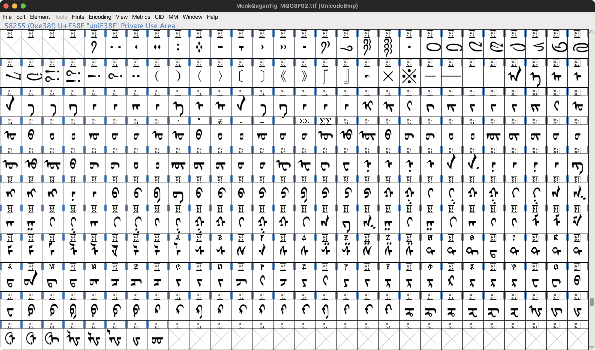

## mongol_code

Unicode conversion library in Dart for traditional Mongolian script 

## Usage

A simple usage example:

```dart
final converter = MongolCode.instance;

// Unicode to Menksoft code
const unicodeInput = 'ᠮᠣᠩᠭᠣᠯ';
final menksoftResult = converter.unicodeToMenksoft(unicodeInput);
print(menksoftResult);

// Menksoft code to Unicode
const menksoftInput = '\uE2C1\uE27F\uE317\uE27E\uE2E8'; // bichig
final unicodeResult = converter.menksoftToUnicode(menksoftInput);
print(unicodeResult);
```

## Menksoft code

Menksoft code encodes glyph forms and letter values in the Unicode Private Use Area. Here are the glyphs from the font:


